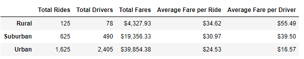

# PyBer_Analysis
Analysis of all the rideshare data from January to early May of 2019 for PyBer company. 

## Project Overview
PyBer is a Python-based ride-sharing app company valued at $2.3 billion. 
The CEO of the company has requested a comprehensive analysis of all rideshare data between January and May 2019. 
The analysis and visualizations produced will help PyBer company improve access to ride-sharing services,  
and determine affordability for underserved neighborhoods. 

## Challenge Background
The CEO has requested a city type-specific analysis of the ride-share data that could showcase any differences and better direct the decision-makers at PyBer. 
This focused analysis needs to be based on the following parameters: total rides, total drivers, total fares, average fare per ride, and driver for each city type. 
In addition, she would like to see a multi-line graph of the weekly sum of fares for each city type between January and early May. 

## Objectives
1. A ride-sharing summary DataFrame by city type.
2. A multiple-line chart of total fares for each city type.

## Resources
- Data Source: city_data.csv; ride_data.csv
- Software: Python (3.9.7) 
- Libraries and Packages: Pandas, Jupyter notebook, and Matplotlib.

## PyBer Focused Analysis Results
1. A comparison of totalities between the three different city types (rural, suburban, urban), reveals the following:
- The total number of rides in rural cities is five to thirteen times less than in suburban and urban cities, respectively. 
- The total number of drivers in rural cities is about six to thirty times less than in suburban and urban cities, respectively.
- The total revenue in rural cities is four to nine times less than the revenue from suburban and urban cities, respectively.
- On average, the cost of a ride in a rural city costs $4 to $11 more than in a suburban or an urban city, respectively.
- The average fare-per-driver is noticeably higher in rural cities, for it is more than three times the average of  fare-per driver in urban cities, and 1.5 times the average in suburban cities.
- It is also worth noting the substantial differences between urban and suburban cities all over the board, but mainly in revenue, where the former had collectively gained  double for the first four months of the year 2019. 
- A ride-sharing summary DataFrame by city type: 

2. A weekly time frame resampling of the total fares from all three city types shows: 
- Consistent revenue disparities between the three groups, with urban cities being the most profitable.  
- Parallel peaks in fare costs during the 3rd week of February 2019. 

A multiple-line chart of total fares for each city type where each week is a peak or dip in the line graphs: 

## Recommendations
1. Based on the results of the analysis, it is advised to increase the number of drivers serving rural and suburban areas to lower the cost of service.
2. Providing benefits and incentives to the company's drivers may encourage better rate control, which can subsequently improve service usage.
3. Further analysis is recommended to collect data on the duration of rides, which would clarify the current rate-per-service; furthermore, estimates of the population of each city would delineate the appropriate number of drivers for each service region. 

---

